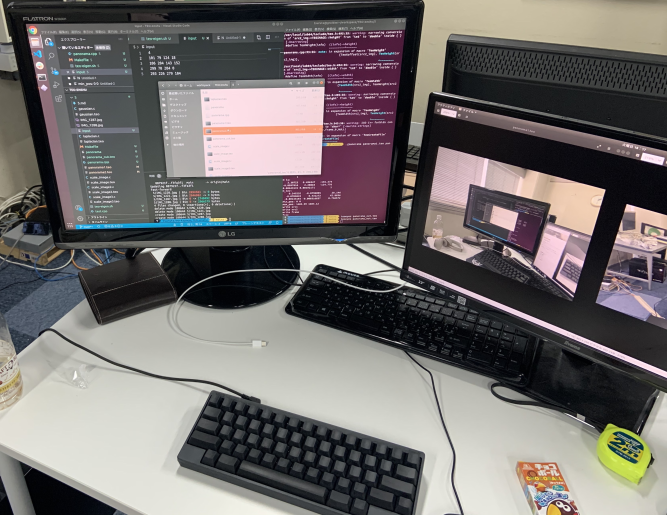
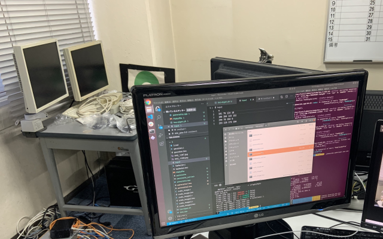
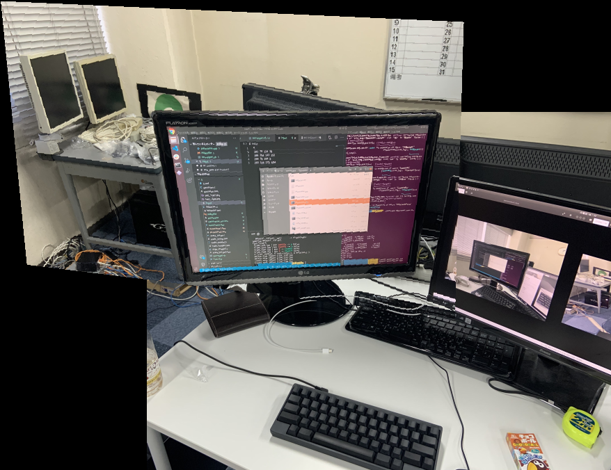

# 5章

画像処理をしてみよう！の章。

基本写経。たまにプログラムの誤植があって辛い(修正依頼済)

## 5-1 ラプラシアンフィルタ
- ひたすら写経
- 画像処理勉強してると割とよく出る

|入力 (../TT.teo)|出力 (teofile/laplacian.teo)|
|:---:|:---:|
|||

### ソースコード

- 実行コマンド
```sh
teo laplacian.c ../TT.teo 
```
<details>
<summary>5/laplacian.c</summary>
<script src="https://gist-it.appspot.com/https://github.com/honehaniwa/TEO-enshu/blob/main/5/laplacian.c"></script>
</details>

## 5-2 ガウシアンフィルタ
- ひたすら写経
- 画像処理勉強してると割とよく出る

|入力 (../TT.teo)|出力 (teofile/gaussian.teo)|
|:---:|:---:|
|||

### ソースコード

- 実行コマンド
```sh
teo gaussian.c ../TT.teo 1.2
```
<details>
<summary>5/gaussian.c</summary>
<script src="https://gist-it.appspot.com/https://github.com/honehaniwa/TEO-enshu/blob/main/5/gaussian.c"></script>
</details>

## 5-3 画像の拡大・縮小
- 写経
- カクカクになったりすればOK

|入力 (../TT.teo)|出力 (teofile/scale_image.teo)|
|:---:|:---:|
|||

### ソースコード

- 実行コマンド
これで画像サイズが1.5倍になる
```sh
teo scale_image.c ../TT.teo 1.5 1.5
```
<details>
<summary>5/scale_image.c</summary>
<script src="https://gist-it.appspot.com/https://github.com/honehaniwa/TEO-enshu/blob/main/5/scale_image.c"></script>
</details>

## 5-4 画素値の内挿1
- まだマシ(5-5がダメ)
- 5-4に比べてカクカクしてなければOK

|入力 (../TT.teo)|出力 (teofile/scale_image2.teo)|
|:---:|:---:|
|||

### ソースコード

- 実行コマンド
これで画像サイズが1.5倍になる
```sh
teo scale_image2.c ../TT.teo 1.5 1.5
```

<details>
<summary>5/scale_image2.c</summary>
<script src="https://gist-it.appspot.com/https://github.com/honehaniwa/TEO-enshu/blob/main/5/scale_image2.c"></script>
</details>

## 5-5
- これは写経ダメ。(色んな意味で)
- 悪いことは言わないからここのソースコードパクって

|入力 (../TT.teo)|出力 (teofile/scale_image3.teo)|
|:---:|:---:|
|||

### ソースコード

- 実行コマンド
これで画像サイズが1.5倍になる
```sh
teo scale_image3.c ../TT.teo 1.5 1.5
```

<details>
<summary>5/scale_image3.c</summary>
<script src="https://gist-it.appspot.com/https://github.com/honehaniwa/TEO-enshu/blob/main/5/scale_image3.c"></script>
</details>

## 5-6 パノラマ画像の生成
- これはなるべく考えよう(どうしても辛くなったら参考にする程度で)
- 射影変換行列のお気持ちをなるべく理解して、最後はそのまま実装で大丈夫
- 画像は自分で準備するもヨシ(ディスプレイみたいな4スミあると楽)、ここのやつをそのまま使うもヨシ

|入力1 (teofile/panorama1.teo)|入力2 (teofile/panorama1.teo)|出力 (teofile/panorama_out.teo)|
|:---:|:---:|:---:|
||||

## 画像の準備方法
- `teofile`内の`panorama{1, 2}.teo`と`input`をそのまま使うのが一番楽
- 自分で作りたいなら以下の手順を踏む

1. 写真を2枚撮る(教科書のやつみたいに角度の違う同じ被写体の画像2枚)
2. teo形式に変換(ついでに画像サイズを小さくするのを忘れずに)
3. 2枚の画像の対応している部分をteoeyesの三みたいなやつ->???で座標を確認。メモる(inputみたいにファイル形式にしておくとよし)
4. 準備完了

## 実装のヒント
- 行列演算用のEigenを使うと行列計算をサボれて楽
- Eigenを使うなら`.cpp`にする必要アリ
- `.cpp`だとcで書かれてるteoライブラリとconflictする
- ので卍先輩直伝、秘伝のMakefile卍を準備しておきました。Eigenのインストール先とファイル名を変えたら使えるはずです
- そのまま実装すると被せる方の画像が拡大縮小と同じ感じで穴ぼこになるので内挿をうまく使ってください(自分は実装サボって無理矢理埋めたのでそこは改善してね)
- 式(5.21)は使わなかったです。そのまま(5.22)を使えばOK

### ソースコード

- 実行コマンド
卍秘伝のMakeFile卍
```sh
make
./{自分で設定したプログラム名} panorama1.teo panorama2.teo < input
```

<details>
<summary>5/panorama.cpp</summary>
<script src="https://gist-it.appspot.com/https://github.com/honehaniwa/TEO-enshu/blob/main/5/panorama.cpp"></script>
</details>

<b>お疲れ様でした！！！！！</b>